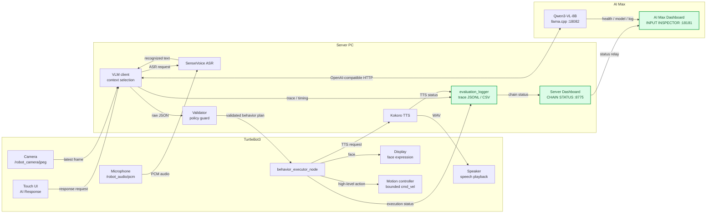
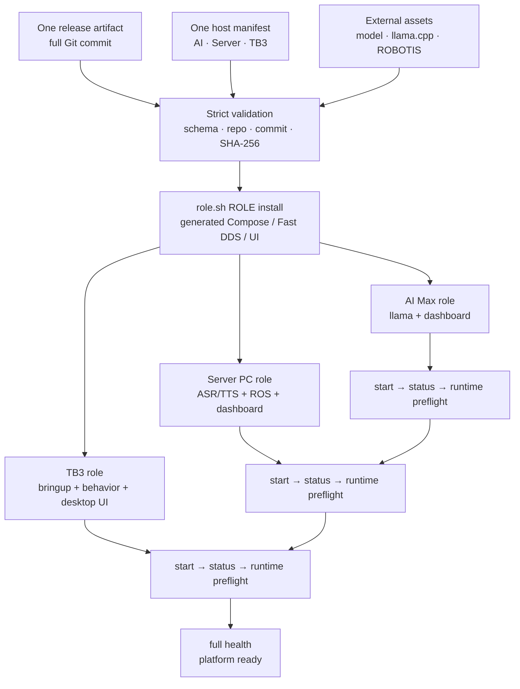
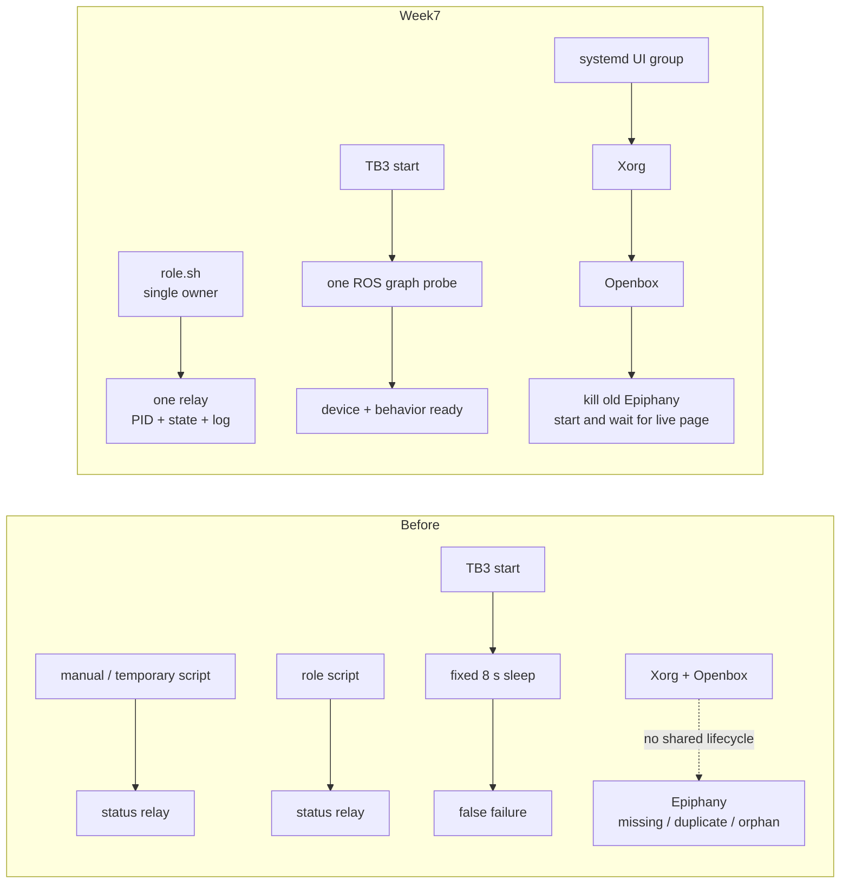
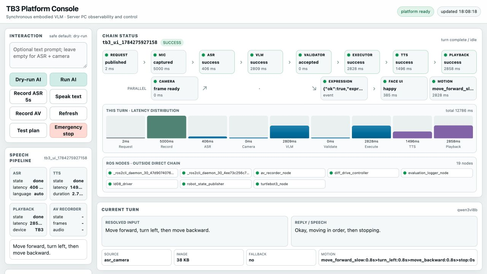
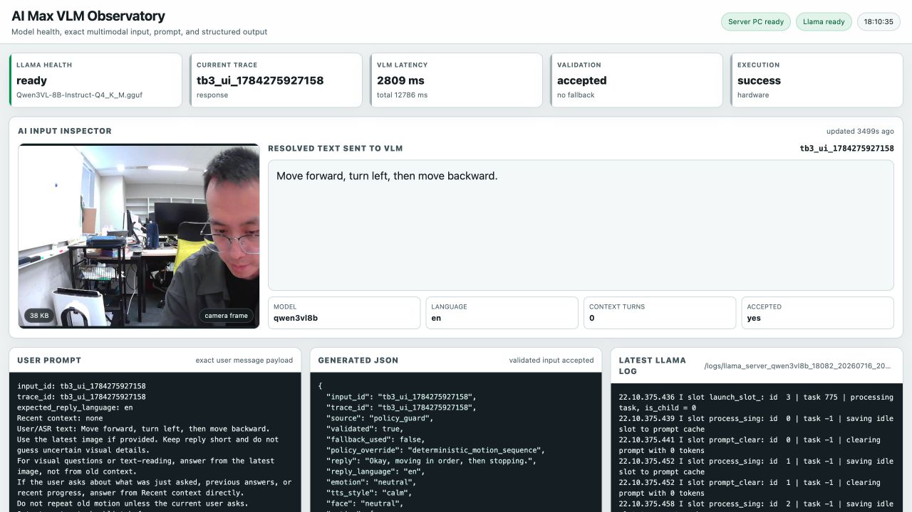
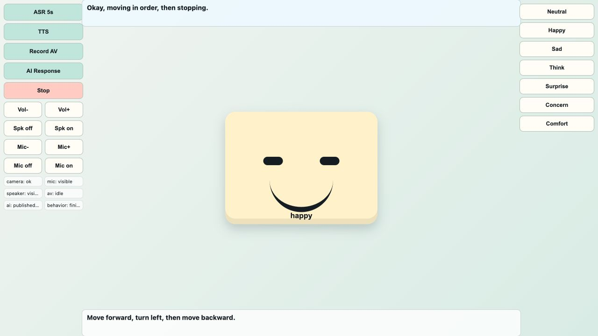

# 7/20報告

## Links

[7/13報告](https://app.notion.com/p/3996e7e4145f814c9f5cd0530ee79fce) · [GitHub](https://github.com/r1file/tb3-multimodal-interaction) · [研究計画](https://app.notion.com/p/3866e7e4145f8098874fca66860d0c3a) · [Week8](https://app.notion.com/p/3996e7e4145f815e93deffca620016b6)

## 概要

Week7では新しいロボット機能を増やさず、Week6の三機platformを**再現可能・診断可能・演示可能**な状態へ整えた。変更点は、role単位のfresh install、single-instance lifecycle、demo前検証、full-chain UI、VLM input inspectorである。

## Week6からの変更

下図はWeek5–6と同じ構成・data flowを継承した。緑色だけがWeek7の追加・更新箇所である。



## 1. Platform productization

一つのentrypointにrole、action、三端共通manifestを明示した。

```bash
bash deploy/role.sh <ai_max|server_pc|tb3> \
  <install|start|stop|restart|status> --manifest PATH
```

各roleは自分のruntimeだけを所有する。host固有値はsource codeや三枚の`.env`に分散させず、同一のTOML manifestに集約した。三端はmanifest SHA-256とGit commitが一致する場合だけ起動する。



Portability auditでは、旧lab IP、home path、camera/ALSA device、container name、model snapshot、static Fast DDS peerをruntime codeから除去した。Fast DDS XML、Compose変数、desktop launcherはmanifestから生成する。Docker base image、application/ROBOTIS/llama.cpp commit、model SHA-256も固定した。一方、ROS topic、JSON schema、whitelist、container内`/workspace`はhost値ではなくinterface contractとして維持した。

Fresh installは **manifest作成 → 同一commitをclone → install preflight → install → AI Max → Server PC → TB3** の順で行う。停止順序は逆である。

三端実機をclean checkoutへ移行した際、旧checkoutはworkspace外へ退避して保存した。ここで①旧colcon metadataが削除済みconfigを参照、②ROS CLI daemonのstale graphがready nodeをmissingと誤判定、③topic毎のCLI probeがTB3で重い、という三点を発見した。canonical startで当該packageの生成cacheだけを再作成し、readinessを一つのrclpy graph participantへ統合して解決した。

## 2. Lifecycle hardening

| 5W1H | 内容 |
| --- | --- |
| When | TB3のcold start、三端restart、長時間運転時に再現した。 |
| Where | Server status relay、TB3 bringup readiness、Xorg/Openbox/Epiphanyの境界。 |
| What | relayが2重化、bringup成功直前に8秒timeoutで誤失敗、desktop起動後もbrowserなしのblack screen、Epiphanyの多重・孤立を観測した。 |
| Who | 手動command、一時script、role scriptが同じcomponentを別々に所有していた。 |
| Why | process ownershipが一意でなく、固定sleepでreadyを判定し、browser lifecycleがdesktop sessionと同期していないと推定した。 |
| How | `status`のprocess count、persistent log、ROS graph、`htop`、画面状態を同一時刻で照合して特定した。role ownershipを一意化し、graph-based readinessとsystemd UI unitへ置換した。 |



修正後のrestart acceptanceは2/2 pass、critical duplicateは0。三回のclean startはAI Max `5/5/5 s`、Server PC `8/8/8 s`、TB3 `78/79/81 s`でreadyとなった。表情animation自体は変更していない。

## 3. UI redesign

### Server PC — CHAIN STATUS



旧AI statusとROS node listを一つのflowへ統合した。各nodeのhealth、現在stageのhighlight、hover detail、chain外node、今回の会話の9段latency barを同じ画面で確認できる。ASRはrecordingと推論を分離し、図のtraceでは `Request 2 ms / Mic 5000 ms / ASR 406 ms` と表示するため、録音待ちをASR model latencyへ誤算入しない。

### AI Max — AI INPUT INSPECTOR



VLMへ実際に送ったcamera frame、resolved text、完全なUser Prompt、生成JSON、latest llama logを一画面へ配置した。llama process監視もhost processを正しく数え、撮影時はllama-server 1 instance、VLM `2809 ms`、validation acceptedを確認した。実運用URLは `http://192.168.64.246:18181` である。

### TurtleBot3 — local UI



端側ではcontrol、I/O状態、reply、recognized text、faceを同時表示する。Xorg/Openbox/Epiphanyを同じlifecycleへ入れたため、SSH logout後も画面を維持し、cold startはlive page確認後にreadyとなる。

## 4. Validation and demo stability

| Check | Result |
| --- | --- |
| Clean start | 3/3 pass、毎回 `TB3_STACK_HEALTH_PASS` |
| Automated test | portability/lifecycle/UIを含むlocal 47 passed、Server ROS container 38 passed |
| Repository audit | 152 files、credential/model/large artifact violation 0 |
| Host portability | lab IP/path/device default 0、Compose 2 role render pass、partial/wrong repo/wrong commit/dirty checkoutは起動拒否 |
| Three-host release acceptance | commit `7fa1a733ab0d31b274b73606d85a86083f89cdbd`、manifest SHA-256 `b19b2fc2…22044cd`、三端status `ready` |
| Runtime preflight | AI Max / Server PC / TB3すべて `PREFLIGHT_PASS`、warning 0、TB3 live `/odom` pass |
| Live I/O smoke | 初回ASR timeoutはsafe degraded、その後3回連続success |
| Final trace | ASR、39,093-byte image、VLM、validation、TTS、playback、face、bounded motion、final stopを確認 |

最後のtrace `tb3_ui_1784275927158`では、VLM `2809 ms`、TTS `1496 ms`、playback `2858 ms`を同一traceで保存した。初回ASR timeoutも成功へ書き換えず、stop-onlyの`degraded`として残した。正式演示ではこのhealth/trace確認後に必要なscenarioだけを選択する。

## 境界と次週

Week7の成果は同期型baselineの製品化・安定化であり、Instant VLM、非同期Reasoning VLM、Coordinatorは未実装である。Week8ではarchitectureを増やさず、同じbaselineのfinal validation、release/tag、backup、正式demoとhandoffを行う。
