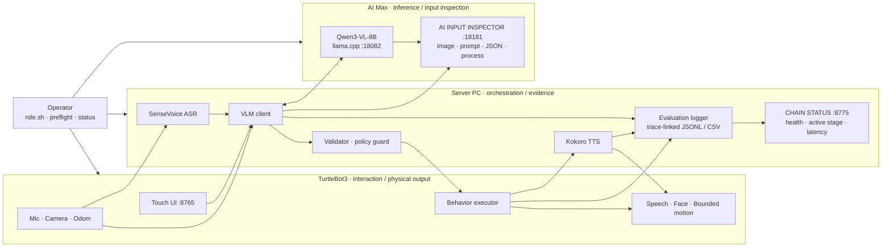

# 7/20報告

## Links

[Week7 technical record](https://app.notion.com/p/3996e7e4145f81ef8f8bde3ca2844ebc) · [Week7 formal demo run sheet](https://app.notion.com/p/3a06e7e4145f81cc8d7ae893d4bb9544) · [7/13報告](https://app.notion.com/p/3996e7e4145f814c9f5cd0530ee79fce) · [研究計画](https://app.notion.com/p/3866e7e4145f8098874fca66860d0c3a) · [Week8 plan](https://app.notion.com/p/3996e7e4145f815e93deffca620016b6) · [GitHub](https://github.com/r1file/tb3-multimodal-interaction)

## 概要

Week7では、Week6で安定化した同期型 embodied VLM prototypeを、**新しい操作者が再現・起動・診断・演示できるplatform baseline**へ移行した。中心は新しいAI機能ではなく、三機構成の製品化、demo安定化、評価dataの標準化、Server PC / AI Max UIの再設計である。

三機すべてに共通のlifecycle interface、fresh-host preflight、persistent log、single-instance保証、rollback/reproduction文書を追加した。実行時には一つの`trace_id`でASR、camera、VLM、validator、executor、TTS、playbackを接続し、Server PCでは処理中のstageとlatency、AI MaxではVLMへ実際に入力された画像・text・User Prompt・生成JSONを確認できるようにした。

Week7 checklistは67/67で完了した。三回のclean start、local 36 tests、Server ROS container 38 tests、repository audit 155 files、GitHub Actionsを通過した。最終I/O smokeでは最初のASR timeoutを隠さず`degraded`として保存し、その後三回連続で`success`、最後のtraceではASR、39,093-byte camera frame、VLM、validator、TTS、TB3 playback、face、bounded motion、final stopまで確認した（[Week7 technical record](https://app.notion.com/p/3996e7e4145f81ef8f8bde3ca2844ebc)、[closeout evidence](https://github.com/r1file/tb3-multimodal-interaction/blob/main/docs/evidence/week7-closeout.md)）。

## Week7のsystem positioning

現在のproduction topologyは、ROS 2をTB3とServer PCの間、OpenAI-compatible HTTPをServer PCとAI Maxの間に置く**同期・single-turn構成**である。VLMが`/cmd_vel`を直接publishせず、validated behavior plan、behavior executor、whitelisted motion controllerを経由する安全境界は維持した。

## 主な開発結果

| Area | Week7 result |
| --- | --- |
| Productization | `.env.example`、role別prerequisite、external asset checksum、install/runtime preflight、fresh checkout rehearsalを整備した。Gitに含まれないmodel・device設定もbuild前に確認できる。 |
| Lifecycle | `deploy/role.sh`を唯一のrole入口とし、actionをinstall、start、stop、restart、statusへ統一した。AI Max → Server PC → TB3のstart、逆順stop、single-instance、persistent log、rotation、rollbackを契約化した。 |
| Diagnostics | `starting / stale / missing / unhealthy / unreachable / ready / stopped`を共通state vocabularyとし、実際のrelay重複、route、permission、Xorg、ROS discovery failureをstatusとlogから特定できるようにした。 |
| Evaluation | `tb3_single_turn_evaluation@1.0.0`を追加し、raw model outputからTB3 playbackまでを一行のJSONL/CSVに統合した。wall clockはlabel、durationはmonotonicとして分離した。 |
| Server PC UI | 旧AI Chain StatusとROS Nodesを一つの`CHAIN STATUS`へ統合し、node別health light、active-stage highlight、hover detail、chain外node、9-stage latency barを実装した。ASR表示も復元した。 |
| AI Max UI | `AI INPUT INSPECTOR`で実際のimage、resolved text、User Prompt、generated JSONを表示し、latest llama logとhost llama-server processを同一画面で監視可能にした。 |
| Demo hardening | 14-row matrix（8 showcase / 5 regression / 1 stress）をfreezeし、language、face、allowed motion、fallback、pass/warn/failを固定した。capability boundaryをmodel任せにしないdeterministic guardを追加した。 |
| Delivery | README、architecture、reproduction、hardware、limitations、troubleshooting、rollback、release checklist、CIを整理し、旧Week pathをhistorical evidenceへ分離した。 |

Week7開始時のbaseline `09f67b3`からengineering closeout `b50055c`まで、7 commits、94 files、6,846 insertions / 342 deletionsの変更となった。これはcore ROS algorithmの大型追加ではなく、分散systemを運用可能にするcontrol、evidence、UI、documentation layerの追加が中心である。

## 1. 三機platformの製品化

### Fresh-host contract

各roleについてOS、Docker/Compose、ROBOTIS Jazzy base、host package、network、device、model assetをmanifest化した。Qwen GGUF/mmproj、SenseVoiceSmall、llama.cpp binary、cache、credentialはGit外に置いたまま、path、version、size、SHA-256をdocument化した。

`deploy/preflight.sh`はinstall phaseとruntime phaseを分離し、missing model、device、route、occupied port、Fast DDS設定、NTP、camera、microphone、speaker、display、ROS node/topic、live `/odom`をactionable errorとして検出する。AI Max、Server PC、TB3のfinal rehearsalはいずれもwarning 0でpassし、Server PCのfresh checkoutは旧`tb3_week2_executor`なしでcolcon buildと13 testsを完了した（[P1 evidence](https://github.com/r1file/tb3-multimodal-interaction/blob/main/docs/evidence/week7-p1-fresh-host-preflight.md)）。

### Lifecycle ownership

以前は手動commandと一時processが混在し、Server status relayが二重起動する状態があった。Week7では各componentのownerをrole scriptへ限定し、PID/state/logをpersistent runtime directoryへ移した。startはreadinessを待ち、stop/restartは同じownerだけを停止する。

TB3ではbringup readinessを一つのrclpy graph probeへまとめ、resourceの小さいRaspberry Piで複数のROS CLIを同時起動しないようにした。Xorg、Openbox、iDesk、Epiphanyはtransient systemd unitとして同じlifecycleに入り、X displayとWebKit pageがliveになるまでstartを成功扱いしない。Epiphanyは起動前に既存instanceを終了し、browser多重化とdesktop lifecycleからの孤立を防いだ。animation自体には変更を加えていない。

二回のrestart acceptanceではAI Max 7/7 s、Server PC 31/30 s、TB3 108/110 sでreadyとなり、重複critical processは0であった。その後の三回のclean-start demo rehearsalでは5/5/5 s、8/8/8 s、78/79/81 sまで安定した（[P2 lifecycle evidence](https://github.com/r1file/tb3-multimodal-interaction/blob/main/docs/evidence/week7-p2-lifecycle-diagnostics.md)、[P4 rehearsal evidence](https://github.com/r1file/tb3-multimodal-interaction/blob/main/docs/evidence/week7-p4-automated-rehearsal.md)）。

## 2. UI再設計とfull-chain observability

### Server PC: CHAIN STATUS

Server PC Web UIは、個別のAI statusとROS node listを読む画面から、実際のdata flowを直接追うoperator consoleへ変更した。

- Request → Mic → ASR → VLM → Validator → Executor → TTS → Playbackをmain flowとして表示する。
- Camera、Expression、Face、Motionをparallel branchとして表示する。
- chainに直接参加しないROS nodeも同じhealth objectでgraph外に表示する。
- nodeごとに独立したhealth lightを持ち、処理中stageをhighlightし、hoverでnode health、stage state、latencyを表示する。
- completed turnはRequest、Record、ASR inference、Camera、VLM、Validation、Execution、TTS、Playbackの9本のbarへ分解する。

重要な修正はASR時間の意味である。旧`asr_ms`はAI Response押下後のASR requestからtext返却までであり、5秒のrecordingを含んでいた。現在は`Request 2 ms / Record 5,000 ms / ASR inference 395 ms / ASR end-to-end 5,408 ms`として分離し、「ASR modelが5秒以上かかった」という誤解を防いだ。

### AI Max: AI INPUT INSPECTOR

AI Max Dashboardはmodel serverのhealth pageから、VLM input/outputを監査できる画面へ変更した。実際に送信されたJPEG、resolved ASR/text、完全なUser Prompt、generated JSON、latest llama logを並列に確認できる。llama process表示のerrorはcontainerへ`procps`とhost PID namespaceを追加して修正し、実hostのllama-serverが正確に一つであることを表示する。

live traceでは48,386-byte image、904-character User Prompt、257-character accepted JSON、VLM 4,642 ms、execution 132 ms、total 4,844 msを同一画面で確認した。両DashboardはDynabook G83の13-inch 1920×1080を基準に再配置し、horizontal overflowなし、Server critical viewは900 px以内に収めた（[P3.5 UI evidence](https://github.com/r1file/tb3-multimodal-interaction/blob/main/docs/evidence/week7-p3-dashboard-observability.md)）。

## 3. Evaluation schemaと技術的trace

新schemaは一つのterminal recordに以下を保持する。

- identity: `scenario_id / trial_id / trace_id / request_id / session_id`
- input: `language / input_source / text / image_bytes / model / mode`
- stage: ASR、VLM、validation、execution、TTS、playbackのstatusとnullable duration
- outcome: fallback、repair action、motion summary、final status、error category
- evidence: raw model output、validated plan、executor/TTS/playback detail

異なる三機のwall clockを引き算せず、wall clockはcorrelation labelに限定し、処理時間はlocal monotonic durationから構成する。text-onlyではASRを`null`、dry-runではTTS/playbackを`not_applicable`とし、未観測stageを成功扱いしない。ASR timeout/no-audioも`degraded/asr_instability`または`error/incomplete`としてdenominatorに残す。

Week6のraw dataは変更せずconverterでsummary化した。preserved baselineは2Bが27 attempts、fallback 3.7%、median VLM/total 1,332/6,747 ms、8Bが32 attempts、fallback 18.8%、median VLM/total 3,306.5/8,741 msである。Week7 schemaはfuture researchでFirst Response Latency等を追加できるが、現時点ではSSAMやasynchronous stageを仮定しないresearch-neutralな形式である（[P3 schema evidence](https://github.com/r1file/tb3-multimodal-interaction/blob/main/docs/evidence/week7-p3-evaluation-schema-validation.md)）。

## 4. Demo安定化

14-row official matrixはsocial response、visual QA、Japanese/English OCR、safe motion、cancel/stop、live facts/news、manipulation、navigation、move-then-observe、unreadable textをcoverする。18回のtext/injected-ASR resultは18個の独立sessionを使用し、最大`context_turns=0`で、stale contextやhidden processへの依存はなかった。

初回のJapanese move-then-observeではmotionは安全にstopしたが、replyが「移動する」と誤って述べた。このfailureを残した上で、日本語phraseをdeterministic `multi_stage_observation_limit`へ追加した。autonomous navigation/mappingも`autonomous_navigation_limit`へ固定し、未実装機能の説明をmodelの偶然に依存させないようにした。

最終のtargeted physical I/O smokeは四つのlive traceを保存した。最初はASR timeoutで`degraded`となったが、policy guardはstop-onlyと再発話案内を実行した。次の三回は連続`success`であり、最後の`tb3_ui_1784275927158`はASR、39,093-byte image、VLM 2,809 ms、TTS 1,496 ms、playback 2,858 ms、`move_forward_slow:0.8s → turn_left:0.8s → move_backward:0.8s → stop`を完了した。TB3 device logにもturnとfinal stopが独立に記録された。

このためWeek7では、Week6と同じfull physical demoを再実行することをengineering exit gateにはしなかった。自動matrix、三回のclean start、targeted I/O smokeで今回の変更範囲をacceptし、14-row matrixはformal presentation時のscenario libraryとして引き継いだ（[formal demo run sheet](https://app.notion.com/p/3a06e7e4145f81cc8d7ae893d4bb9544)）。

## 検証結果

| Check | Result |
| --- | --- |
| Week7 checklist | 67/67 complete |
| Role status | AI Max / Server PC / TB3すべて`ready`、critical process single-instance |
| Clean start | 3/3 pass、full healthは毎回`TB3_STACK_HEALTH_PASS` |
| Fresh checkout | legacy ROS packageなしでbuild/test pass |
| Repository-safe local suite | 36 passed |
| Complete Server ROS-container suite | 38 passed |
| Repository audit | 155 files、credential / model / large artifact violationなし |
| GitHub Actions | `repository-validation` success |
| Live I/O | 1 safe degraded + 3 consecutive success、最後はfull I/O + final stop |

## 研究計画に対する位置づけとWeek8境界

本研究計画の最終目的は、低遅延のInstant VLMと非同期Reasoning VLMを協調させ、structured handoff、Safety Gate、Continue/Adjust/Repair coordinatorによりperceived latencyと応答一貫性を改善することである（[研究計画](https://app.notion.com/p/3866e7e4145f8098874fca66860d0c3a)）。

Week7で完成したものは、その比較対象となる**同期型 / delayed-response baseline**である。ASR、camera、VLM client、validator、behavior executor、TTS、face、motion、context、trace、dashboardはfuture systemで再利用できる。一方、以下は未実装であり、今回の結果として主張しない。

- low-risk instant response
- asynchronous Reasoning VLM lifecycle
- observation / hypothesis / confidence / riskを持つstructured handoff
- Continue / Adjust / Repair Behavior Coordinator
- SSAM、dynamic planning、participant study

Week8はcore architectureを変更せず、release-candidate freeze、clean-start/safety再検証、formal demo/video、final metrics、GitHub tag/release、backupとoperator handoffを行う。Instant/async research implementationはWeek8後の別phaseで開始する（[Week8 plan](https://app.notion.com/p/3996e7e4145f815e93deffca620016b6)）。

## 制限

ASRは固定recording windowとfirst-turn timeout/誤認識の可能性がある。cameraはcurrent frameのみであり、move後に再撮影して同一turnで再推論することはできない。live facts、manipulation、Nav2/autonomous mappingは未実装である。visual/OCR correctnessはlighting、focus、text sizeに依存し、formal demoではInspector imageとphysical ground truthの照合が必要である。

また、現platformはFast DDS peer profile、ROS domain、ROBOTIS Jazzy container、host-specific device pathに依存する。これらはpreflightとdocumentで明示されたが、完全なhardware abstractionではない。

## 結論と次週

Week7で、三機embodied VLM systemを「動作するprototype」から「再現、運用、診断、評価、演示できるplatform baseline」へ進めた。特に、canonical lifecycle、fresh-host contract、trace-linked evaluation、full-chain UI、input inspector、deterministic capability boundaryにより、失敗を隠さず原因とstageを特定できるようになった。

Week8では実装範囲をfreezeし、同じbaselineを最終条件で再検証してreleaseする。研究上は、この同期baselineのfull-response latencyとfailure dataが、今後のInstant + Reasoning VLM条件に対する比較基準となる。

## Sources

- [7/13報告](https://app.notion.com/p/3996e7e4145f814c9f5cd0530ee79fce)
- [研究計画：小型移動ロボットにおける低リスクInstant VLM応答と非同期Reasoning VLMの協調](https://app.notion.com/p/3866e7e4145f8098874fca66860d0c3a)
- [Week7 todo / technical record](https://app.notion.com/p/3996e7e4145f81ef8f8bde3ca2844ebc)
- [Week7 formal demo run sheet](https://app.notion.com/p/3a06e7e4145f81cc8d7ae893d4bb9544)
- [Week8 final validation and handoff plan](https://app.notion.com/p/3996e7e4145f815e93deffca620016b6)
- [GitHub repository](https://github.com/r1file/tb3-multimodal-interaction)
- Local evidence: `docs/evidence/week7-*.md`, `docs/evaluation-schema.md`, `docs/architecture.md`, `docs/limitations.md`
