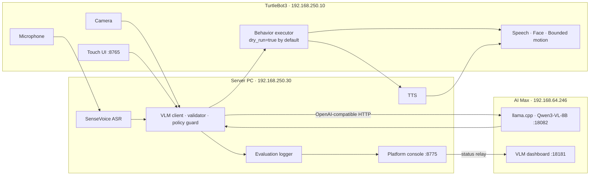

# Architecture

The production topology is a synchronous, single-turn embodied VLM pipeline.
ROS 2 traffic stays between Server PC and TB3; AI Max is reached over HTTP.

## TurtleBot3 role

- `turtlebot3_bringup`: base, odometry, and velocity control.
- `device_stack.launch.py`: camera, microphone, face, speech, expression, and
  motion nodes.
- `behavior_executor_node`: validated plan execution with a final stop and
  optional dry-run.
- Touch UI on port 8765.

## Server PC role

- ASR and TTS adapters in dedicated Docker containers.
- `server_control_node` dashboard on port 8775, with a live end-to-end chain
  graph, per-node health, active-stage highlighting, hover latency details,
  ASR monitoring, and per-turn latency distribution.
- `vlm_behavior_client_node`: context selection, AI Max request, policy guards,
  validation, behavior-plan publication, and exact VLM input inspection.
- `evaluation_logger_node`: persists P3 evaluation records and publishes the
  latest completed record for both dashboards.
- Status relay from Server PC to AI Max dashboard.

## AI Max role

- Existing llama.cpp runtime with Qwen3-VL GGUF and mmproj files.
- Default Qwen3-VL-8B service on port 18082.
- Read-only operations dashboard on port 18181, including the exact input
  image, resolved text, User Prompt, generated JSON, evaluation status, and
  host llama.cpp process state.

## Stable interfaces

The migration changes package, file, service, and deployment names. ROS topic
contracts remain stable, including `/robot_ai/status`, `/robot_behavior/plan`,
`/robot_tts/request`, `/robot_face/expression`, and
`/robot_motion/action_cmd`. P3 observability adds
`/robot_ai/input_inspector` for the exact VLM request/response view and
`/robot_evaluation/status` for the latest completed latency record. The VLM
never publishes `/cmd_vel` directly.

## Service and interface map

| Interface | Owner | Consumer | Purpose |
| --- | --- | --- | --- |
| `:18082` | AI Max llama.cpp | Server VLM client | Qwen3-VL inference and health |
| `:18181` | AI Max dashboard | Operator | VLM inputs, JSON, logs, process health |
| `:8775` | Server dashboard | Operator and status relay | Full-chain health, latency, and controls |
| `:8765` | TB3 face/touch UI | Operator and Server health | Face state and local interaction |
| `/robot_ai/request` | Server/TB3 UI | VLM client | Single-turn request contract |
| `/robot_behavior/plan` | VLM client | TB3 behavior executor | Validated bounded behavior plan |
| `/robot_evaluation/status` | Evaluation logger | Dashboards | Latest completed evaluation record |
| `/robot_motion/action_cmd` | Behavior executor | Motion controller | Whitelisted motion action |
| `/robot_a/cmd_vel` | Motion controller | TurtleBot3 base | Final velocity command |

The static Fast DDS peer profile and `ROS_DOMAIN_ID=30` form the current ROS
discovery contract. See [hardware.md](hardware.md) for device discovery and
[limitations.md](limitations.md) for routed-network and research boundaries.
